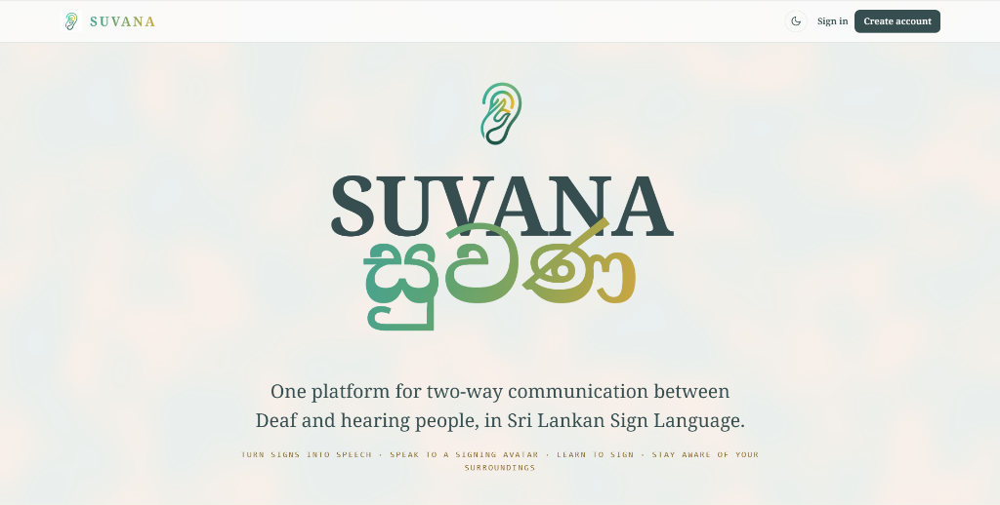

# සුවණ Suvana

One platform for real-time two-way Deaf–hearing communication in Sri Lankan Sign Language (SSL). Integrated, single-brand build of the four components of SLIIT IT4010 research project **R26-SE-019** (Jan 2026 cohort). There are no sub-brands inside Suvana — the names the components were built under standalone (Sawana, SignSpeak, SoundGuard) live only in their source repos.

## Structure

| Path | Module | Stack |
|---|---|---|
| `apps/shell` | The Suvana landing — owns the domain root and proxies the modules | Static HTML, Vite (dev proxy + build) |
| `apps/learn` | **Learn** — gamified SSL learning & practice, served at `/learn/` | React + Vite, MediaPipe Tasks Vision in-browser, DTW scoring |
| `apps/communicate` | **Communicate** — speech → 3D signing avatar, with audio emotion recognition | Next.js 16 full-stack (MongoDB + Auth.js, Cloudinary, Three.js); ASR/emotion served externally |
| `apps/alerts` | **Alerts** — sound awareness / SOS companion app | Expo / React Native, TF.js |
| `services/recognition` | **Recognize** — sign → speech: browser-side capture streamed over a WebSocket, plus its own Suvana-branded frontend | FastAPI + TensorFlow + MediaPipe |
| `services/sound-awareness` | Sound-classification backend utilities for the mobile app | Python |
| `services/speech` | Sinhala Whisper ASR + audio emotion service (extracted from the Colab notebook; deploys as a Docker container, e.g. a Hugging Face Space) | FastAPI + PyTorch |
| `tools/reference-converter` | Dataset video → landmark reference pipeline feeding `apps/learn` | Python + MediaPipe |
| `packages/branding` | Suvana palette tokens and logos | — |

## Provenance

Fresh-history monorepo bootstrapped **24 Aug 2026** from working-tree snapshots. Full histories remain in the source repos.

| Path | Source | Commit |
|---|---|---|
| `apps/shell`, `apps/learn`, `tools/reference-converter` | `ChamaraIT22076816/R26-SE-019` → `learn-ssl-module/` | `7f6fc4f` |
| `services/recognition` | `ChamaraIT22076816/R26-SE-019` → `sinhala_sign_language_recognition/` | `7f6fc4f` |
| `apps/alerts`, `services/sound-awareness` | `ChamaraIT22076816/R26-SE-019` → `soundguard-karindra/` | `7f6fc4f` |
| `apps/communicate` | [`lithiraMalkith/Sign-Detector`](https://github.com/lithiraMalkith/Sign-Detector) | `6fdfd04` ("Update #2", 16 Aug 2026) |

Deliberately excluded from every snapshot: git histories, `node_modules`, Python venvs, build outputs, datasets, and ~293 MB of Mixamo test FBX files (`lib/models` in Sign-Detector — nothing in code references them). The team repo's `SSL-Transformer/` folder was a stale placeholder and was not copied; the PP1 Python demo stays in the team repo as historical reference.

## One-domain topology

One domain serves the whole web product. The shell (`apps/shell`) owns the root; `apps/learn` builds with Vite `base: '/learn/'` and `apps/communicate` runs with Next `basePath` `/communicate` (set via `NEXT_PUBLIC_BASE_PATH`), which namespaces its pages, assets and API routes under that prefix, and the shell proxies it:

- **Production**: the `rewrites` in `apps/shell/vercel.json` forward `/learn/*` and `/communicate/*` to their own deployments. **Deploy order matters**: deploy `apps/learn` and `apps/communicate` first (each its own Vercel project; Communicate needs the env vars from `.env.local.example`), paste their production URLs over the `REPLACE-WITH-LEARN-DEPLOYMENT` / `REPLACE-WITH-COMMUNICATE-DEPLOYMENT` placeholders, then deploy `apps/shell`.
- **Dev**: the shell's Vite proxy maps `/learn` → `localhost:5174` and `/communicate` → `localhost:3000`, so `localhost:5173` mirrors production. Start all three dev servers.
- **`services/recognition` is the exception**: it streams camera frames over a WebSocket, and Vercel rewrites do not proxy WebSocket upgrades. It runs on its own origin (a `recognize.` subdomain or the container host) and serves its own Suvana-branded frontend, so it needs no CORS. See `services/recognition/DEPLOY-SUVANA.md`.
- Client code must never call `fetch("/api/...")` with a bare absolute path — route it through `apiPath()` from `lib/basePath.ts` (basePath does not rewrite raw fetches). Unset `NEXT_PUBLIC_BASE_PATH` and everything collapses to standalone behaviour, matching Lithira's original deployment.

## Running

- **`apps/shell`** — `npm install`, then `npm run dev` (port 5173). Serves the landing and proxies the other modules.
- **`apps/learn`** — `npm install`, then `npm run dev` (port 5174, served under `/learn/`). The `predev` hook regenerates `public/reference-index.json`; running `npx vite` directly skips it and the app loads with no references. Runtime asset paths must use `import.meta.env.BASE_URL` — a bare `/references/...` breaks under the prefix.
- **`apps/communicate`** — `npm install`, copy `.env.local.example` → `.env.local` and fill it, then `npm run dev`. Needs MongoDB Atlas, an Auth.js secret, Cloudinary keys and the ngrok shared secret — all avatar models and gloss animations live in Cloudinary, not in this repo; the speech backend URL is read from MongoDB at runtime.
- **`apps/alerts`** — `npm install`, then `npx expo run:android` (a dev build is required: the app has a custom native module, so Expo Go will not run it).
- **`services/recognition`** — `pip install -r requirements.txt`, then see its README. Before wiring into the web shell, verify the webcam is captured browser-side (frames/landmarks sent to the API), not server-side.

## Licences

Reference corpora in `apps/learn`: `kaggle_*` files are CC0; `yohan_*` files are **CC BY-NC-SA 4.0 (non-commercial)**. Licence files ship alongside the data.

## Near-term work

1. Branding pass — palette tokens + logos into `packages/branding`, retheme every frontend, strip all sub-brand names from UI copy.
2. One-domain topology (rewrites or subdomains) tying `apps/shell`, `apps/learn` and `apps/communicate` together.
3. Extract `services/speech` from the notebooks and point `apps/communicate` at a persistent URL (a DB config write — no code change).
4. Wire `services/recognition` into the shell; SoundGuard rebrand build.
5. Unified sign-on across modules is documented future work, not current scope.
